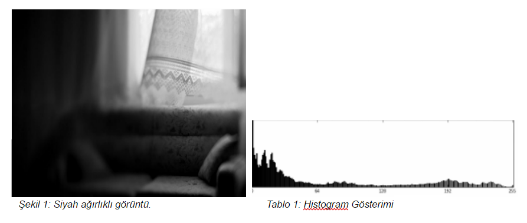

= Görüntüde Gölge Yumuşatma
== 1)İçindekiler
. İçindekiler
. Versiyon Geçmişi
. Bölüm 1 -Histogram Aralığı ile Gölge Tespiti
.. Histogram Nedir?
.. Histogram Dengeleme
.. Histogram Eşitleme
.. Python ile Histogram Dengelemenin Görüntüye Uygulanması
.. Sonuçlar
. Referanslar

