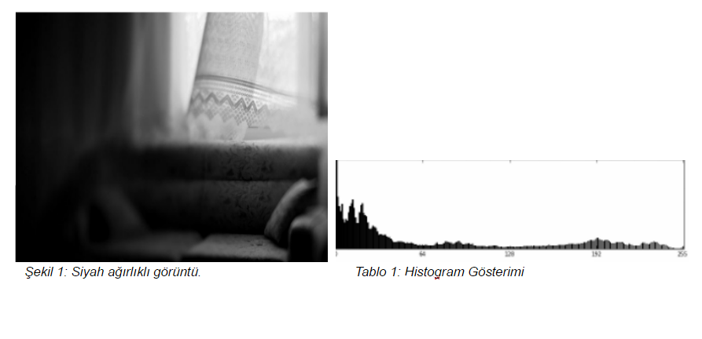

= Görüntüde Gölge Yumuşatma
== 1)İçindekiler
. İçindekiler
. Versiyon Geçmişi
. Bölüm 1 -Histogram Aralığı ile Gölge Tespiti
.. Histogram Nedir?
.. Histogram Dengeleme
.. Histogram Eşitleme
.. Python ile Histogram Dengelemenin Görüntüye Uygulanması
.. Sonuçlar
. Referanslar

|===
|Tarih|Değişiklik|Kişi

|05.01.2017
|Görüntüde Gölge Yumuşatma

|Gönül Toktay
|10.01.2017
 
|Görüntüde Gölge Yumuşatma
|M.Sıla Genç

|30.01.2017

|Düzenleme
|Merve Tafralı

|===

== 3)Histogram Aralığı ile Gölge Tespiti

=== 3.1)  Histogram Nedir?
Matematiksel olarak histogram; gruplandırılmış bir veri dağılımının sütun grafiğiyle gösterimidir. Görüntüde ise her piksel seviyesini gösteren bir ölçüttür. Histogram grafiklerine bakılarak bir görüntüde parlaklık durumu veya görüntünün tonlamaları hakkında bilgi edinilebilmektedir. Aşağıda görüntüler ve histogram grafiklerinin örnekleri yer almaktadır. +

image::2.png[r2]

Tabloların yatay ekseni gri değer aralıklarını düşey eksenler ise bu aralıklardaki piksel sayısını göstermektedir. 

=== 3.2)Histogram Dengeleme
Bir görüntüdeki renk değerlerinin belli bir yerde kümelenmiş olmasından kaynaklanan, renk dağılımı bozukluğunu gidermek için kullanılan bir yöntemdir. +
Histogram matematiksel olarak aşağıdaki şekilde gösterilebilir. +
→h(rk )=nk +

rk : k’nıncı parlaklık değeri +
nk : k nıncı parlaklık değerinin görüntüdeki sayısı +

8-bit parlaklıklı görüntüde 256 gri seviye vardır. Örnek olarak tüm değerler ilk 100 değerde toplanırsa renkleri fark etmek zorlaşmaktadır. +
Dönüştürülmüş ve orjinal olan histogramlar grafiklerde görüldüğü üzere olasılık yoğnluğu olarakta gösterilebilmektedir. +

image::16.png[r4]

Görüntü histogramı incelendiğinde ani artışlar ton grup aralıkları olarak ifade edilebilmektedir. Görüntüde var olabilen bu kısımlar gölge olarak belirlenerek gerekli işlemler yapılabilmektedir. +

Sayısal görüntü işlemede en basit ve en çok kullanılan araçlardan birisi gri seviyesi histogramıdır. Bu fonksiyon  görüntünün gri seviyesi içeriği hakkında bilgiler elde edilmesini sağlar. Histogramdan elde edilebilecek bazı bilgiler: +

* Koyu bir görüntünün histogram grafiğinin düşük gri seviye bölgesine yığılacağı açıktır.

* Parlak (Açık renk) düzgün bir görüntünün histogram grafiğinin büyük gri seviye bölgesine yığılacağı açıktır.

* Eğer histogram bir bölgeye yığılmış ise ( yani gri sviye ekseninin belirli bir bölgesine) bu görüntünün kontrastı kötüdür denir.

* İyi kontraslı bir resmin histogram grafiği tüm gri seviye değerlerine eşit yayılmış olduğunu açıklar.

Görüntüdeki gölgenin yumuşatılması için gerçekleştirilecek işlemler bu işlemlerle benzerlik göstermektedir. Yani  gölge olarak belirlenen bölgenin yani piksellerin renk değerlerinin görüntünün geneline uyarlanmasıdır.

=== 3.3) Histogram Eşitleme

İdeal olarak Histogram eşitleme; Giriş histogramını, her gri seviyesinde eşit piksel sayısına sahip bir histograma dönüştürme işlemi gibi düşünülebilir. Bu pratikte mümkün değildir. Bu yöntem histogramı dar olan resimler ya da resim içindeki bölgeler için daha iyi sonuç verir. Yani Histogram eşitleme renk değerleri düzgün dağılımlı olmayan resimler için uygun bir görüntü iyileştirme metodudur. Resmin tümüne uygulanabileceği gibi sadece belli bir bölgesine de uygulanabilir. Tüm resme uygulanırsa global histogram eşitleme, resmin belli bir bölgesine uygulandığında ise lokal histogram eşitleme adını alır. +

Histogram eşitlemenin özeti olarak; +

Bu formülü uygulama adımlarına dökecek olursak; +
. Resmin histogramı bulunur (her gri seviye için piksel sayısı grafiği).

. Histogramdan yararlanılarak kümülatif histogram bulunur. Kümülatif histogram, histogramın her değerinin kendisinden öncekiler ve kendisinin toplamı ile elde edilen değerleri içeren büyüklüktür. 

. Kümülatif histogram değerleri normalize edilip (toplam piksel sayısına bölünerek), yeni resimde olmasını istediğimiz max. renk değerleri ile çarpılır, çıkan değer tam sayıya yuvarlatılır. Böylelikle yeni gri seviye değerleri elde edilmiş olur.

 . Eski (Orijinal) gri seviye değerleri ile; 3.adımda elde edilen gri seviye değerleri biribirine karşılık düşürülür ve yeni histogram grafiği çizilir.

*n*: giriş görüntüsündeki toplam piksel sayısı (n0+n1+…….+nL-1 = n) 
*nj (nk )*: j. gri seviyedeki piksel sayısı
* L*: mümkün olan (veya istenilen) toplam gri seviye sayısı( 8 bit renk derinliğinde 255 v.b)
 *sk* : Daha iyi kontraslı bir görüntü elde etmek için gri seviye dönüşüm değeri.
Amaç; imgedeki düşük görünürlüğü iyileştirmektir.

=== 3.4) Python ile Histogram Dengelemenin Görüntüye Uygulanması

[source,python]
---------------------------------------------------------------------
import numpy as np       #numpy kütüphanesi eklenmiştir.
import pylab as plt     # Ekrana grafik olarak çizdirmemizi sağlayacak pylab kütüphanesinden plt modülü eklenmiştir.
import matplotlib.image as mpimg    #Görüntünün çok yönlü numpy dizisi olarak alınmasını sağlayacağımız mpimg modülü eklenmiştir.

def imhist(im):         #imhist fonksiyonu ile parametre olarak gönderilen görüntünün renk histogramı hesaplanır.
    m, n = im.shape     #Görüntünün numpy dizisi olarak boyutu m,n değişkenlerine atanır.
    h = [0.0] * 256     #Histogram değerlerini tutacak h adında 256 elemanlık bir matris tanımlanır.
    for i in range(m):      #Görüntünün boyutu değerince oluşturulan iç içe döngüler ile görüntü üzerinde dolaşılır.
        for j in range(n):
            h[im[i, j]]+=1      #Görüntünün tüm piksel değerleri için histogram bir arttırılarak histogram matrisi bulunur.
    return np.array(h)/(m*n)        #Bulunan histogram değerleri numpy dizisine dönüştürülür ve görüntünün büyüklüğüne bölünür. Böylece ilk adım olan renk aralıklarını toplam boyuta bölerek renk frekansları bulma işlemi gerçekleştirilir.

def cumsum(h):      #Kümülatif olarak tüm histogram değerleri toplanır.
    return [sum(h[:i+1]) for i in range(len(h))]

def histeq(im):     #Histogram eşitleme işlemini yapacağımız fonksiyonumuz resim parametresi ile çalışmaktadır.
    h = imhist(im)      #Gelen resmin histogram tablosu çıkarılır.
    cdf = np.array(cumsum(h))       #Kümülatif dağılım fonksiyonu hesaplanır ve numpy dizisine dönüştürülür.
    sk = np.uint8(255 * cdf)    #Kümülatif dağılım fonksiyonu değerleri kullanılarak görüntünün değerleri 0-255 arasına çekilir yani normalize bir gri değer elde edilir.
    s1, s2 = im.shape       #Görüntünün boyutları alınır.
    new_im = np.zeros_like(im)       #Yeni görüntü için 0'lık bir np dizisi oluşturulmuştur.
    for i in range(0, s1):      #Görüntü boyutu değerince iç içe döngü oluşturulur.
        for j in range(0, s2):
            new_im[i, j] = sk[im[i, j]]     #Görüntüden alınan piksel değerleri ile Kümülatif dağılım fonksiyonundan aldığımız değerleri eşleyerek yeni görüntünün piksel değerlerini elde ediyoruz.
    return new_im       #Elde edilen görüntü geri gönderilir.

img = np.uint8(mpimg.imread('image.png')*255.0)     #İlk olarak png formatındaki görüntümüzü matris biçiminde 0-255 değerleri arasına indirgeyerek matris olarak okuyoruz.#Okuduğumuz görüntüyü griye çevirme işlemi için kullanılan katsayılar ile çarparak görüntüyü griye çeviriyoruz.Ve çevirme işleminden sonra görüntü tekrar normalize olarak 0-255 değerleri arasına çekilir.
img = np.uint8((0.2126* img[:,:,0]) + \
          np.uint8(0.7152 * img[:,:,1]) +\
             np.uint8(0.0722 * img[:,:,2]))

new_img = histeq(img)       #Görüntüyü histeq fonksiyonuna göndererek histogramları eşitlenmiş halini elde ediyoruz. 

#Son olarak bu görüntüleri ekrana çizdiriyoruz.
plt.subplot(121)        #plt modülünden subplot fonksiyonu ile görüntünün durması gereken noktayı seçiyoruz.
plt.imshow(img)         #imshow ile çizdirilecek görüntü gösterilir.
plt.title('Orjinal Resim')      #Yazılacak olan başlık belirlenir.
plt.set_cmap('gray')        #Görüntülerin gri düzeyinde gösterilmesini sağlar.

plt.subplot(122)
plt.imshow(new_img)
plt.title('Histogram Esikleme Yapilan Resim')
plt.set_cmap('gray')
plt.show()

---------------------------------------------------------------------

=== 3.4)Sonuçlar
1.Orjinal Resim

2.Histogram Eşitleme Yapılan Resim

== 4)Referanslar
. https://prezi.com/fajf0ktf0l4z/goruntu-isleme/
. https://mcagriberke.wordpress.com/2013/06/18/digital-image-processing-sayisal-goruntu-isleme/
. http://eng.harran.edu.tr/moodle/moodledata/100/Ders_Sunumlari/Hafta_4.pdf
. http://web.firat.edu.tr/iaydin/bmu357/bmu_357_bolum2.pdf
. https://gist.github.com/bistaumanga/6309599
. https://www.tutorialspoint.com/dip/histogram_equalization.htm
. http://www.atasoyweb.net/Histogram-Esitleme

